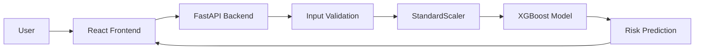
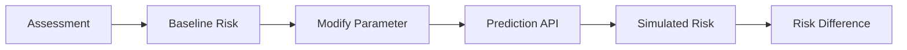

# 🫀 CardioGuard

## AI-Powered Cardiovascular Risk Assessment & Health Intelligence Platform

CardioGuard is an AI-powered web application designed to estimate cardiovascular disease risk using clinical health parameters and provide personalized, explainable health insights.

The platform combines:

- Machine Learning
- Risk Prediction
- What-If Analysis
- User Authentication
- Assessment History
- Health Insights

## 🌐 Live Demo

-  (https://tanishqtiwari1.github.io/Pbl_project/)

## 🚀 Features

- 🩺 Cardiovascular Risk Prediction
- 🔬 What-If Risk Simulation
- 📊 Model Insights & Explainable AI
- 🔐 User Authentication & Password Reset
- 📋 Assessment History
- ⚠️ Input Validation
- 📱 Responsive Web Interface

## 🧠 System Workflow



## 🔬 What-If Analysis

The What-If Lab allows users to modify selected clinical parameters and observe how the predicted cardiovascular risk changes.



## 🧠 Machine Learning Model

CardioGuard uses an XGBoost classifier with 9 clinical features:

- Age
- Sex
- Blood Pressure
- Cholesterol
- Fasting Blood Sugar
- Resting ECG
- Maximum Heart Rate
- Exercise-Induced Angina
- Oldpeak

## 🔄 ML Pipeline

```text
Clinical Inputs
      ↓
Data Validation
      ↓
Feature Scaling
      ↓
XGBoost Classifier
      ↓
Risk Probability
      ↓
CardioGuard Dashboard
```

## 🛠️ Tech Stack

- Frontend: React, Vite, JavaScript
- Backend: Python, FastAPI
- Machine Learning: XGBoost, Scikit-learn
- Data Processing: Pandas, NumPy
- Database: SQLite
- Frontend Deployment: GitHub Pages
- Backend Deployment: Render

## 🔗 System Architecture

```mermaid
                    ┌───────────────┐
                    │     USER      │
                    └───────┬───────┘
                            │
                            ▼
                 ┌────────────────────┐
                 │  REACT FRONTEND    │
                 │  (User Interface)  │
                 └─────────┬──────────┘
                           │
                           │ HTTP Request
                           ▼
                 ┌────────────────────┐
                 │  FASTAPI REST API  │
                 │    (Backend)       │
                 └─────────┬──────────┘
                           │
                           ▼
                 ┌────────────────────┐
                 │  INPUT VALIDATION  │
                 │ Check user inputs  │
                 └─────────┬──────────┘
                           │
                           ▼
                 ┌────────────────────┐
                 │   STANDARDSCALER   │
                 │ Feature Scaling    │
                 └─────────┬──────────┘
                           │
                           ▼
                 ┌────────────────────┐
                 │   XGBOOST MODEL    │
                 │   ML Prediction    │
                 └─────────┬──────────┘
                           │
                           ▼
                 ┌────────────────────┐
                 │   RISK PREDICTION  │
                 │ Risk + Probability │
                 └─────────┬──────────┘
                           │
                           ▼
                 ┌────────────────────┐
                 │  REACT FRONTEND    │
                 │ Display Results &  │
                 │ Recommendations    │
                 └─────────┬──────────┘
                           │
                           ▼
                    ┌─────────────┐
                    │    USER     │
                    └─────────────┘


        ┌──────────────────────┐
        │   SQLite Database    │
        │ User/Prediction Data │
        └──────────┬───────────┘
                   │
                   │ Store / Retrieve
                   ▼
             ┌──────────────┐
             │ FastAPI API  │
             └──────────────┘
```

## 👩‍💻 Author

- Tanishq Tewari
- Computer Science Engineering

## ⚠️ Disclaimer

CardioGuard is an educational and research project.

It is not intended to provide medical diagnosis or replace professional medical advice.
