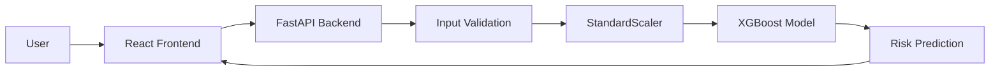
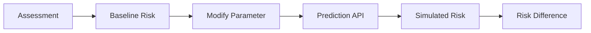

# 🫀 CardioGuard

## AI-Powered Cardiovascular Risk Assessment & Health Intelligence Platform

CardioGuard is a heart-risk screening platform for **individuals and community health workers**. Anyone can check their 10-year heart risk without hospital tests, ASHA workers can screen people door to door even without internet, and patients with clinical results get a detailed estimate. Every result comes with a clear next step.

## 🌐 Live Demo

- https://tanishqtiwari1.github.io/Pbl_project/

## 🚀 Features

**Real-world screening**
- 🏠 **Home screening, no hospital tests:** 10-year heart risk from age, smoking, diabetes, blood pressure and BMI (Framingham Heart Study model). Shown as a percentage and as "N out of 100 people like you".
- 👩‍⚕️ **Community screening for ASHA workers:** screen and register people door to door, flag high-risk people for referral, track *referred → visited doctor*, and print a referral slip for the health centre.
- 📶 **Works offline:** installable app (PWA). Screenings are calculated on the phone and synced automatically when the internet returns.
- 🚨 **Emergency check first:** heart attack and stroke warning signs show "Call 108 / 112" and what to do while waiting, instead of a risk score. Also available without logging in at `/#/emergency`.
- 🇮🇳 **Hindi and English** for screening, community and emergency pages.
- 📄 **Fill from a lab report:** photograph or upload a blood test, BP or ECG report; values are read in the browser (OCR) and shown for checking before they fill the form. The report never leaves the device.
- 🩺 **Report for your doctor (PDF):** results, main contributing factors, trend over time, and personalised questions to ask.

**Clinical tools**
- 🩺 Clinical risk prediction (XGBoost, 10 clinical inputs)
- 🔬 What-if risk simulation
- 📊 Model transparency: real metrics, calibration chart, fairness by sex/age/hospital, and a model card
- 🔐 Authentication, password reset, assessment history

## 🧠 System Workflow


```mermaid
flowchart LR
    A[User] --> B[React Frontend]
    B --> C[FastAPI Backend]
    C --> D[Input Validation]
    D --> E[StandardScaler]
    E --> F[XGBoost Model]
    F --> G[Risk Prediction]
    G --> B
```

## 🔬 What-If Analysis

The What-If Lab allows users to modify selected clinical parameters and observe how the predicted cardiovascular risk changes.


```mermaid
flowchart LR
    A[Assessment] --> B[Baseline Risk]
    B --> C[Modify Parameter]
    C --> D[Prediction API]
    D --> E[Simulated Risk]
    E --> F[Risk Difference]
```

## 🧠 Machine Learning Models

Full details, including fairness results and limitations, are in [MODEL_CARD.md](MODEL_CARD.md).

### 1. Home screening model (no hospital tests)

Logistic regression trained on the **Framingham Heart Study** teaching dataset (4,240 adults followed for 10 years; 644 developed coronary heart disease). Inputs: age, sex, smoking and cigarettes per day, BP medicine, previous stroke, diagnosed hypertension, diabetes, systolic BP, and BMI (optional).

| Metric (848 held-out people) | Value |
|---|---|
| ROC-AUC | 0.705 (5-fold CV 0.732 ± 0.033) |
| Brier score | 0.122 |
| Sensitivity / specificity at the 20% "high risk" cut-off | 45.7% / 79.5% |
| Sensitivity / specificity at the 10% "moderate" cut-off | 79.8% / 50.5% |

Adding cholesterol and glucose didn't improve accuracy, so the model needs no blood test. The model is saved as plain numbers in `screening_model.json` and the browser runs the same calculation, which is what lets it work offline. Framingham participants were mostly white Americans, so the app warns that risk may be underestimated for South Asians.

```bash
cd Backend/ml
python prepare_framingham.py      # downloads and checks framingham.csv
python train_screening_model.py   # -> screening_model.json
```

### 2. Clinical model

CardioGuard uses an XGBoost classifier with 10 clinical features:

- Age
- Sex
- Chest Pain Type
- Blood Pressure
- Cholesterol
- Fasting Blood Sugar
- Resting ECG
- Maximum Heart Rate
- Exercise-Induced Angina
- Oldpeak

#### Dataset

The model is trained on the **UCI Heart Disease database** ([Janosi et al., 1988](https://archive.ics.uci.edu/dataset/45/heart+disease)): **918 real patients** from four hospitals (Cleveland Clinic, Hungarian Institute of Cardiology, University Hospitals Zurich & Basel, VA Long Beach). The target is whether angiography found more than 50% narrowing in a major heart vessel.

#### Results (held-out test set of 184 patients the model never saw)

| Metric | Value |
|---|---|
| Accuracy | 82.1% |
| Precision | 83.5% |
| Recall | 84.3% |
| F1-score | 83.9% |
| ROC-AUC | 0.915 |
| 5-fold CV accuracy (training set) | 81.2% ± 3.5% |

The earlier `heart.csv` (Kaggle) had 1025 rows but only 302 unique patients, so about 97% of its "test" rows were copies of training rows and its ~97% accuracy was not real; on unique rows that model scored ~74.5%.

**Retrain:**

```bash
cd Backend/ml
python prepare_dataset.py   # downloads the 4 UCI files -> heart_disease_uci.csv
python train_model.py       # grid search + evaluation -> model.pkl, scaler.pkl, metrics.json
```

**Tests:**

```bash
cd Backend && pip install -r requirements-dev.txt && python -m pytest tests     # API, offline sync, privacy
node --test Frontend/src/services/reportParser.test.mjs                         # lab report reading
```

**Note:** everyone in this dataset was referred for angiography, so "no chest pain" (asymptomatic) patients in it had a high disease rate. The model learns this, so a symptom-free person can score higher than someone with atypical chest pain. Treat the output as a screening estimate, not a diagnosis.

## 🔄 ML Pipeline

```text
Clinical Inputs
      ↓
Data Validation
      ↓
Feature Scaling
      ↓
XGBoost Classifier
      ↓
Risk Probability
      ↓
CardioGuard Dashboard
```

## 🛠️ Tech Stack

- Frontend: React, Vite, JavaScript, PWA (service worker, offline outbox)
- Backend: Python, FastAPI
- Machine Learning: XGBoost, Scikit-learn (logistic regression)
- In-browser OCR and PDF: Tesseract.js, PDF.js, jsPDF
- Data Processing: Pandas, NumPy
- Database: SQLite
- Frontend Deployment: GitHub Pages
- Backend Deployment: Render

## 🔗 System Architecture

```mermaid
                    ┌───────────────┐
                    │     USER      │
                    └───────┬───────┘
                            │
                            ▼
                 ┌────────────────────┐
                 │  REACT FRONTEND    │
                 │  (User Interface)  │
                 └─────────┬──────────┘
                           │
                           │ HTTP Request
                           ▼
                 ┌────────────────────┐
                 │  FASTAPI REST API  │
                 │    (Backend)       │
                 └─────────┬──────────┘
                           │
                           ▼
                 ┌────────────────────┐
                 │  INPUT VALIDATION  │
                 │ Check user inputs  │
                 └─────────┬──────────┘
                           │
                           ▼
                 ┌────────────────────┐
                 │   STANDARDSCALER   │
                 │ Feature Scaling    │
                 └─────────┬──────────┘
                           │
                           ▼
                 ┌────────────────────┐
                 │   XGBOOST MODEL    │
                 │   ML Prediction    │
                 └─────────┬──────────┘
                           │
                           ▼
                 ┌────────────────────┐
                 │   RISK PREDICTION  │
                 │ Risk + Probability │
                 └─────────┬──────────┘
                           │
                           ▼
                 ┌────────────────────┐
                 │  REACT FRONTEND    │
                 │ Display Results &  │
                 │ Recommendations    │
                 └─────────┬──────────┘
                           │
                           ▼
                    ┌─────────────┐
                    │    USER     │
                    └─────────────┘


        ┌──────────────────────┐
        │   SQLite Database    │
        │ User/Prediction Data │
        └──────────┬───────────┘
                   │
                   │ Store / Retrieve
                   ▼
             ┌──────────────┐
             │ FastAPI API  │
             └──────────────┘
```

## 👩‍💻 Author

- Tanishq Tewari
- Computer Science Engineering

## ⚠️ Disclaimer

CardioGuard is an educational and research project.

It is not intended to provide medical diagnosis or replace professional medical advice.
